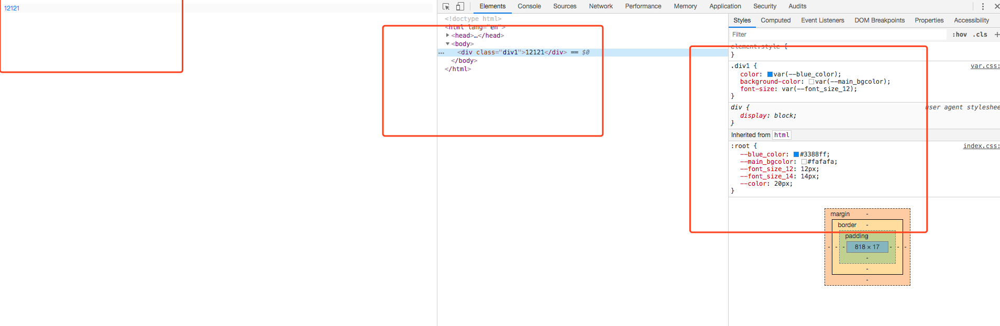

#### css的原生变量

一般在开发中经常能遇到一些文字具有相同的字体、大小、颜色、行高等属性。在这种情况下，我们大部分选择都是sass、less用变量去解决，方便可维护性高。否则UI一改动则牵一发而动全身。但是这篇文章我们不介绍sass和less，我们讨论css原生的变量用法。看以下代码和执行的效果：
```html
<div class="div1">12121</div>
```

```css
// 设置HTML文档的背景色
:root {
  --blue_color: #3388ff;
  --main_bgcolor: #fafafa;
  --font_size_12: 12px;
  --font_size_14: 14px;
  --color: 20px;
}

.div1{
  color: var(--blue_color);
  background-color: var(--main_bgcolor);
  font-size: var(--font_size_12);
}
```


